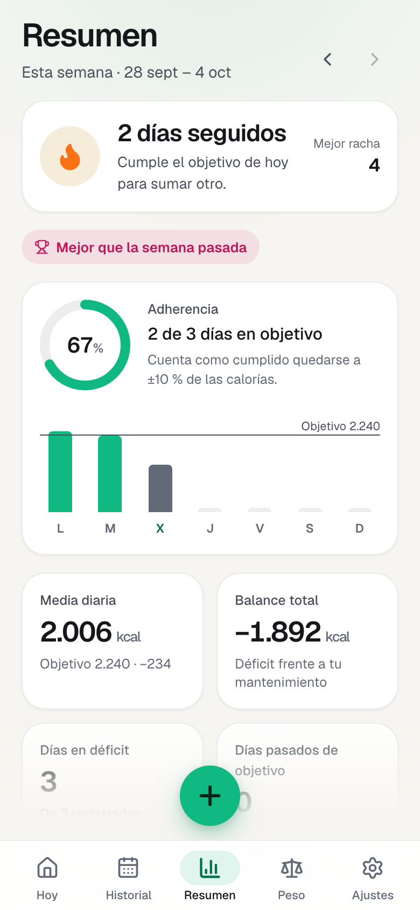
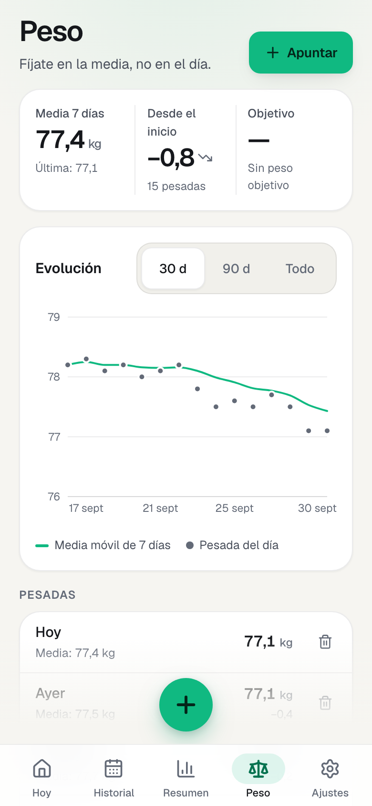
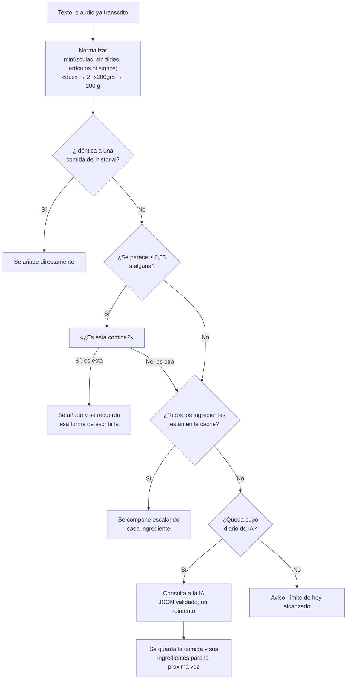
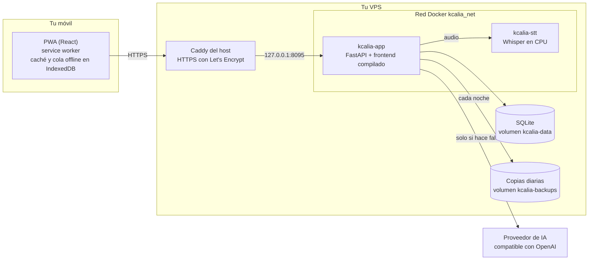

<div align="center">


# Kcalia

**Calorías y macros, con calma.**
Cuenta lo que comes con una frase, una foto o un audio. Lo que repites se recuerda, así que casi nunca hace falta volver a preguntar a la IA.

[](https://github.com/Alvaro-Rovira/kcalia/actions/workflows/ci.yml)
[](LICENSE)


<picture>
  <source media="(prefers-color-scheme: light)" srcset="docs/hero-light.png" />
  
</picture>

</div>

Kcalia es una PWA para uso personal, en español y pensada primero para el móvil. Se instala en el iPhone o en Android como una app más, funciona sin conexión para lo que ya conoce y vive en tu propio servidor: tus datos no salen de ahí.

<div align="center">

</div>

## Índice

- [Características](#características)
- [Capturas](#capturas)
- [Cómo se ahorra IA](#cómo-se-ahorra-ia)
- [Cómo se calculan los objetivos](#cómo-se-calculan-los-objetivos)
- [Arquitectura](#arquitectura)
- [Stack](#stack)
- [Puesta en marcha con Docker](#puesta-en-marcha-con-docker)
- [Variables de entorno](#variables-de-entorno)
- [Despliegue en una VPS](#despliegue-en-una-vps)
- [Migrar a un dominio propio](#migrar-a-un-dominio-propio)
- [Instalar la app en el móvil](#instalar-la-app-en-el-móvil)
- [Elegir el modelo de IA](#elegir-el-modelo-de-ia)
- [Copias de seguridad](#copias-de-seguridad)
- [Desarrollo y pruebas](#desarrollo-y-pruebas)
- [Roadmap](#roadmap)
- [Licencia](#licencia)

## Características

**Registrar lo que comes**

- **Texto libre.** «Dos huevos revueltos con una tostada de pan integral y aceite» se convierte en ingredientes con gramos, calorías, proteínas, hidratos y grasas. Antes de guardar ves el desglose y puedes corregir cualquier cantidad.
- **Foto.** La imagen se reduce en el móvil y el modelo de visión estima el plato. Puedes añadir una nota («era media ración»).
- **Voz.** Grabas, se transcribe con un Whisper propio que corre en tu servidor (unos 4-5 segundos por frase en CPU) y el texto sigue el mismo camino que si lo hubieras escrito.
- **Momento del día** detectado por la hora (desayuno, comida, merienda, cena, snack) y editable.
- **Raciones** ×0,5, ×1, ×1,5, ×2 o a medida, y gramos por ingrediente: todo se recalcula en el móvil, sin IA.
- **Favoritos y recientes** a un toque.

**Entender cómo vas**

- **Hoy:** anillo de calorías con lo que te queda, anillos de proteínas, hidratos y grasas, y un mensaje según lo que falte («Te quedan 32 g de proteína: una lata de atún o 120 g de pavo y listo»).
- **Diario por días:** desliza entre días o semanas, edita, borra con «Deshacer» y añade a días pasados.
- **Resumen semanal**, calculado en código: adherencia, media diaria, balance frente a tu mantenimiento, días en déficit y días pasados, mejor y peor día, tendencia de peso, comparación con la semana anterior y proyección («a este ritmo, 1 kg cada 2,4 semanas», con ≈ 7.700 kcal por kilo de grasa). Se guarda solo cada domingo.
- **Racha, insignias y logros.**
- **Peso** con gráfica y media móvil de 7 días, para mirar la tendencia y no el día.

**Lo demás**

- **Objetivos** calculados sin IA, editables a mano y recalculables cuando cambia tu peso, con avisos de seguridad.
- **PWA**: instalable, con iconos y pantallas de arranque para iOS, tema claro, oscuro o automático, y áreas seguras del notch.
- **Sin conexión**: el diario, el historial y los resúmenes se ven igual. Las comidas que ya conoce se añaden y se sincronizan al volver la red; las nuevas avisan de que necesitan conexión.
- **Una sola cuenta**: inicio de sesión con contraseña cifrada (Argon2) y registro que se cierra al crear la cuenta.
- **Tus datos son tuyos**: exportación a JSON y CSV, y borrado de datos o de la cuenta desde Ajustes.

## Capturas

| | Oscuro | Claro |
|---|---|---|
| **Hoy** |  |  |
| **Revisar y guardar** |  |  |
| **Historial** |  |  |
| **Resumen semanal** |  |  |
| **Peso** |  |  |

<details>
<summary>Más pantallas: acceso, plan, añadir comida y ajustes</summary>

| Acceso | Tu plan | Añadir comida | Ajustes |
|---|---|---|---|
|  |  |  |  |

</details>

Las capturas y el GIF salen de la app real con `scripts/capture_screenshots.py`, que la levanta con una IA simulada y datos de demostración temporales.

## Cómo se ahorra IA

Cada consulta a un modelo cuesta dinero y tiempo. La mayoría de lo que comemos se repite, así que antes de llamar a la IA Kcalia intenta resolver la comida con lo que ya sabe:



1. **Coincidencia exacta.** El texto se normaliza (minúsculas, sin tildes, sin artículos ni signos, números y unidades en forma canónica) y se busca en tu historial. «Un café con leche» y «café con leche!» son la misma comida.
2. **Coincidencia aproximada.** Si se parece mucho a algo que ya tienes (similitud ≥ 0,85), te lo pregunta con un toque. Hay dos salvaguardas para no confundir comidas distintas: las cantidades tienen que coincidir («2 huevos» no es «3 huevos») y cada palabra debe tener su pareja («pechuga de pollo» no es «pechuga de pavo»). Si dices que sí, esa forma de escribirla queda aprendida y la próxima vez es exacta.
3. **Caché de ingredientes.** De cada respuesta de la IA se guardan los macros por 100 g de cada alimento y cuánto pesa su unidad habitual. Si ya se vio «2 huevos y una tostada de pan integral», «3 huevos» se resuelve escalando, sin preguntar.
4. **IA**, solo si nada de lo anterior encaja, con un tope diario configurable (`AI_DAILY_LIMIT`).

Los pasos 1 y 2 también se hacen en el propio móvil, sobre el historial que ya tiene guardado: por eso son instantáneos y funcionan sin conexión. La normalización existe dos veces, en Python y en TypeScript, y ambas se prueban contra el mismo fichero de casos para que no diverjan.

En **Ajustes** hay un contador de consultas ahorradas, desglosado por cada vía.

Las fotos siempre pasan por la IA (no hay texto que comparar), pero la comida resultante entra en tu historial y la próxima vez la tienes en recientes.

## Cómo se calculan los objetivos

Sin IA y sin cajas negras: la app enseña el cálculo paso a paso.

1. **Metabolismo basal** con Mifflin-St Jeor: `10 × peso + 6,25 × altura − 5 × edad`, `+5` en hombres y `−161` en mujeres.
2. **Mantenimiento**: basal × factor de actividad (1,2 · 1,375 · 1,55 · 1,725 · 1,9).
3. **Ajuste según el objetivo:**

| Objetivo | Calorías | Proteína | Grasas |
|---|---|---|---|
| Definición ligera | −15 % | 2,0 g/kg | 0,9 g/kg |
| Definición agresiva | −25 % | 2,2 g/kg | 0,8 g/kg |
| Mantenimiento | 0 % | 1,8 g/kg | 0,9 g/kg |
| Recomposición | −2,5 % | 2,2 g/kg | 0,9 g/kg |
| Volumen | +7,5 % | 1,8 g/kg | 1,0 g/kg |

4. **Hidratos**: las calorías que quedan, a 4 kcal por gramo.

**Avisos de seguridad.** El plan nunca baja de 1.200 kcal en mujeres ni de 1.500 en hombres, ni propone un déficit mayor de 1.000 kcal al día. Con un IMC por debajo de 18,5 no aplica déficit y lo dice. Con un IMC por encima de 30 calcula proteína y grasa con un peso de referencia, para no proponer cantidades desproporcionadas. Avisa si el objetivo queda por debajo del metabolismo basal, si eres menor de edad o si el peso objetivo no cuadra con el plan. Son orientaciones generales, no consejo médico.

## Arquitectura



- **Un contenedor para la app**: FastAPI sirve la API y el frontend ya compilado. La clave de la IA vive solo ahí; el navegador nunca la ve.
- **Un contenedor para la voz**: faster-whisper con una API compatible con OpenAI. Carga el modelo en la primera petición y lo libera tras diez minutos sin uso, para no ocupar memoria en un servidor compartido.
- **Sin puertos abiertos**: la app escucha solo en `127.0.0.1` y el servicio de voz solo dentro de su red Docker. El HTTPS lo pone el Caddy que ya tenga el host.
- **Tareas periódicas en el propio proceso**: copia diaria de la base de datos y resumen semanal del domingo, sin cron externo.
- **Sin conexión**: la caché de datos se guarda en IndexedDB y los cambios hechos sin red van a una cola. Cada comida lleva un identificador generado en el móvil, así que reenviar la cola no duplica nada.

```
backend/    API, cálculos, coincidencias, resumen semanal y cliente de IA (Python)
frontend/   PWA (React + TypeScript), sistema de diseño en tokens CSS
stt/        Servicio de transcripción (faster-whisper)
e2e/        Prueba de extremo a extremo e IA simulada para pruebas
deploy/     Despliegue en VPS y bloque de Caddy
scripts/    Clave de IA, iconos y capturas
```

## Stack

| Capa | Tecnologías |
|---|---|
| API | Python 3.12, FastAPI, SQLAlchemy 2, SQLite (WAL), Pydantic, Argon2, rapidfuzz, httpx |
| Frontend | React 19, TypeScript, Vite, Tailwind CSS 4, Motion, Recharts, TanStack Query, Lucide, Geist auto-hospedada |
| PWA | vite-plugin-pwa (Workbox), IndexedDB |
| Voz | faster-whisper (CTranslate2) en CPU |
| IA | Cualquier proveedor compatible con la API de OpenAI; por defecto Kimi K2.6 (Moonshot) |
| Infraestructura | Docker Compose, Caddy, GitHub Actions |
| Pruebas | pytest, Vitest, Playwright |

**Diseño.** Todos los colores, radios, sombras y duraciones salen de `frontend/src/styles/tokens.css`. Cada macro tiene siempre el mismo color (calorías de naranja a esmeralda según avanza, proteínas índigo, hidratos ámbar, grasas rosa) y nunca va solo: lo acompañan su letra (P, H, G) y su icono. La paleta se comprobó con simulación de daltonismo; el coral inicial de las grasas se confundía con el verde de las calorías en deuteranopia y por eso es un rosa más azulado. Las animaciones respetan `prefers-reduced-motion`.

## Puesta en marcha con Docker

Necesitas Docker con Compose y la clave de un proveedor de IA compatible con OpenAI.

```bash
git clone https://github.com/Alvaro-Rovira/kcalia.git
cd kcalia
cp .env.example .env
```

Para probarlo en tu ordenador, sin proxy ni HTTPS, añade estas dos líneas a `.env`:

```bash
COOKIE_SECURE=false
GZIP=true
```

Guarda la clave de la IA (el script la pide sin mostrarla) y arranca:

```bash
./scripts/set-ai-key.sh
docker compose up -d --build
```

Abre <http://localhost:8095>, elige «Créala ahora» y crea tu cuenta.

El primer arranque tarda unos minutos: compila el frontend y descarga el modelo de voz (unos 460 MB con `small`). Las imágenes ocupan unos 300 MB la app y 1,8 GB la de voz.

Sin clave la app funciona igual para todo lo que no sea analizar comidas nuevas.

## Variables de entorno

Todas viven en `.env`. `.env.example` las trae comentadas.

| Variable | Por defecto | Para qué sirve |
|---|---|---|
| `DOMAIN` | `kcalia.roviradev.duckdns.org` | Dominio público. Es el único sitio donde aparece. |
| `APP_PORT` | `8095` | Puerto local (solo loopback) al que llega el proxy. |
| `TZ` | `Europe/Madrid` | Zona horaria para las copias y el resumen del domingo. |
| `AI_BASE_URL` | `https://api.moonshot.ai/v1` | Base de la API compatible con OpenAI. |
| `AI_API_KEY` | vacío | Clave de la IA. Se rellena con `scripts/set-ai-key.sh`. |
| `AI_MODEL` | `kimi-k2.6` | Modelo para el texto. |
| `AI_VISION_MODEL` | vacío | Modelo para las fotos. Vacío usa `AI_MODEL`. |
| `AI_VISION_BASE_URL`, `AI_VISION_API_KEY` | vacío | Solo si quieres otro proveedor para las fotos. |
| `AI_DAILY_LIMIT` | `60` | Tope de consultas de IA al día (texto y foto). |
| `AI_TIMEOUT` | `45` | Segundos de espera máxima a la IA. |
| `WHISPER_MODEL` | `small` | Modelo de voz: `tiny`, `base`, `small` o `medium`. |
| `WHISPER_THREADS` | `3` | Hilos de CPU para transcribir. |
| `STT_DAILY_LIMIT` | `100` | Tope de audios al día. |
| `STT_BASE_URL`, `STT_API_KEY`, `STT_MODEL` | contenedor propio | Para usar un servicio de voz externo compatible con OpenAI. |
| `SESSION_DAYS` | `180` | Duración de la sesión; se renueva con el uso. |
| `BACKUP_KEEP` | `7` | Copias diarias que se conservan. |
| `COOKIE_SECURE` | `true` | `false` solo para probar en `http://localhost`. |
| `GZIP` | `false` | Compresión desde la propia app; útil sin proxy delante. |

## Despliegue en una VPS

Pensado para un servidor que ya tiene otros proyectos: red y volúmenes propios, ningún puerto abierto al exterior, límites de memoria (384 MB la app, 1,5 GB la voz), sistema de ficheros de solo lectura, sin privilegios y con rotación de logs.

Requisitos: Docker con Compose, Caddy instalado en el host y el dominio apuntando a la VPS.

```bash
./deploy/deploy.sh
```

El script, en este orden:

1. Clona o actualiza el repositorio en `/opt/kcalia`.
2. Crea `.env` a partir de `.env.example` si no existe.
3. Construye y arranca los contenedores.
4. Ejecuta `deploy/caddy-site.sh`, que añade **solo** el bloque de Kcalia al `Caddyfile` del host. Hace copia antes, valida la configuración y, si no valida, restaura la copia y no recarga. Si valida, recarga Caddy en caliente, sin cortar los demás sitios.
5. Comprueba que `https://$DOMAIN/api/health` responde.

El servidor de destino se indica con `DEPLOY_HOST`:

```bash
DEPLOY_HOST=usuario@tu-servidor ./deploy/deploy.sh
```

**La clave de la IA** se pone en el servidor sin que pase por ningún chat ni quede en el historial de la terminal:

```bash
ssh -t root@TU_SERVIDOR /opt/kcalia/scripts/set-ai-key.sh
```

```bash
ssh root@TU_SERVIDOR 'cd /opt/kcalia && docker compose up -d app'
```

Comandos útiles, ya dentro del servidor y en `/opt/kcalia`:

```bash
docker compose ps
docker compose logs -f --tail=100 app
docker compose restart app
```

## Migrar a un dominio propio

El dominio es una sola variable. Para cambiarlo:

1. Apunta el registro `A` del dominio nuevo a la IP de la VPS.
2. Cambia `DOMAIN` en `/opt/kcalia/.env`.
3. Aplica el cambio:

```bash
cd /opt/kcalia && docker compose up -d app && ./deploy/caddy-site.sh
```

Caddy pide el certificado nuevo solo. No hay que tocar código: las metas para compartir el enlace también salen de `DOMAIN`.

Al cambiar de dominio tendrás que iniciar sesión otra vez y reinstalar la app en el móvil, porque para el navegador es un sitio distinto. Tus datos siguen en el servidor.

## Instalar la app en el móvil

**iPhone y iPad (Safari)**

1. Abre la dirección de tu instalación en **Safari**.
2. Pulsa **Compartir**.
3. Elige **Añadir a pantalla de inicio** y confirma.

Se abre a pantalla completa, con su icono y su pantalla de arranque. La primera vez que dictes o hagas una foto, iOS pedirá permiso para el micrófono o la cámara.

**Android (Chrome)**

Menú del navegador y **Instalar aplicación**, o desde **Ajustes → Instalar como app** dentro de Kcalia.

Cuando hay una versión nueva, la app muestra un aviso con el botón «Actualizar».

## Elegir el modelo de IA

Cambiar de modelo es cambiar `AI_MODEL` (y `AI_BASE_URL` y la clave si cambias de proveedor). El cliente se adapta: a los modelos Kimi les desactiva el razonamiento y no les envía temperatura, porque la fijan ellos; al resto les pide temperatura baja. Si un proveedor rechaza algún parámetro, reintenta con lo mínimo.

Para decidir con datos y no con impresiones, hay una herramienta que mide cualquier modelo contra 19 comidas de referencia: error de calorías y macros, latencia y coste.

```bash
docker compose exec app python -m app.bench --price-in 0.95 --price-out 4.00
```

```bash
docker compose exec app python -m app.bench --model otro-modelo --price-in 0.25 --price-out 2.00
```

Usa la clave que ya está en el contenedor y no la muestra.

## Copias de seguridad

Cada noche se guarda una copia consistente de la base de datos, comprimida, en el volumen `kcalia-backups`. Se conservan las siete últimas.

```bash
docker compose exec app ls -lh /backups
```

Para restaurar una (cambia la fecha):

```bash
docker compose stop app
```

```bash
docker run --rm -v kcalia_kcalia-data:/data -v kcalia_kcalia-backups:/backups alpine sh -c "gunzip -c /backups/kcalia-2026-09-30.db.gz > /data/kcalia.db && rm -f /data/kcalia.db-wal /data/kcalia.db-shm && chown 10001 /data/kcalia.db"
```

```bash
docker compose start app
```

Los volúmenes viven en el mismo servidor. Si quieres protegerte de perder la máquina, copia `kcalia-backups` fuera de ella.

## Desarrollo y pruebas

Necesitas [uv](https://docs.astral.sh/uv/) y Node 24.

```bash
make test
```

```bash
make e2e
```

`make dev` indica cómo arrancar la API con la IA simulada y el frontend con recarga en caliente.

| Qué se prueba | Dónde | Pruebas |
|---|---|---|
| Metabolismo basal, objetivos, avisos de seguridad | `backend/tests/test_nutrition.py` | 24 |
| Normalización, similitud y coincidencias | `backend/tests/test_textnorm.py`, `test_matching.py` | 69 |
| Resumen semanal, proyección, racha, media móvil, logros | `backend/tests/test_summary.py` | 12 |
| Validación de la respuesta de la IA y cliente de voz | `backend/tests/test_ai.py` | 13 |
| API completa con IA simulada | `backend/tests/test_api.py` | 19 |
| HTML servido y copias de seguridad | `backend/tests/test_spa.py`, `test_jobs.py` | 8 |
| Audio de Chrome, Safari y Firefox decodificado para Whisper | `stt/test_audio.py` | 5 |
| Formato es-ES, fechas, momentos del día, espejo de la normalización | `frontend/src/lib/*.test.ts` | 80 |
| Flujo completo en un móvil de 390 px | `e2e/test_flow.py` | 9 |

La prueba de extremo a extremo levanta la app real con una IA simulada (`e2e/fake_ai.py`) y recorre: acceso y creación de cuenta, cuestionario inicial, registrar una comida con IA, repetirla sin gastar IA, confirmar una parecida, apuntar el peso, ver el resumen, trabajar sin conexión y sincronizar al volver la red, y cerrar sesión. Comprueba además que la IA se llama exactamente las veces esperadas.

**Lighthouse**, siempre en primera visita y sin caché:

| Medición | Rendimiento | Accesibilidad | Buenas prácticas |
|---|---|---|---|
| Las cinco pantallas con sesión y datos, móvil simulado (red lenta, CPU ×4), en local | 90 – 93 | 100 | 100 |
| Pantalla de acceso en producción, móvil simulado | 88 – 97 según la pasada | 100 | 100 |
| Pantalla de acceso en producción, escritorio | 98 | 100 | 100 |

El rendimiento en móvil varía entre pasadas porque lo que pesa es ejecutar el JavaScript con la CPU frenada. A partir de la segunda visita el service worker lo sirve todo desde el dispositivo. El SEO no se persigue: es una app privada y se excluye de los buscadores a propósito.

## Roadmap

- [ ] Añadir un ingrediente a mano dentro de una comida
- [ ] Escáner de códigos de barras con Open Food Facts
- [ ] Copiar un día entero o una comida a otro día
- [ ] Recordatorios para registrar y para pesarse
- [ ] Objetivos distintos para días de entrenamiento y de descanso
- [ ] Fibra, agua y alcohol
- [ ] Copia de seguridad fuera del servidor
- [ ] Importar datos desde otras apps

## Licencia

[MIT](LICENSE) © 2026 Álvaro Rovira
